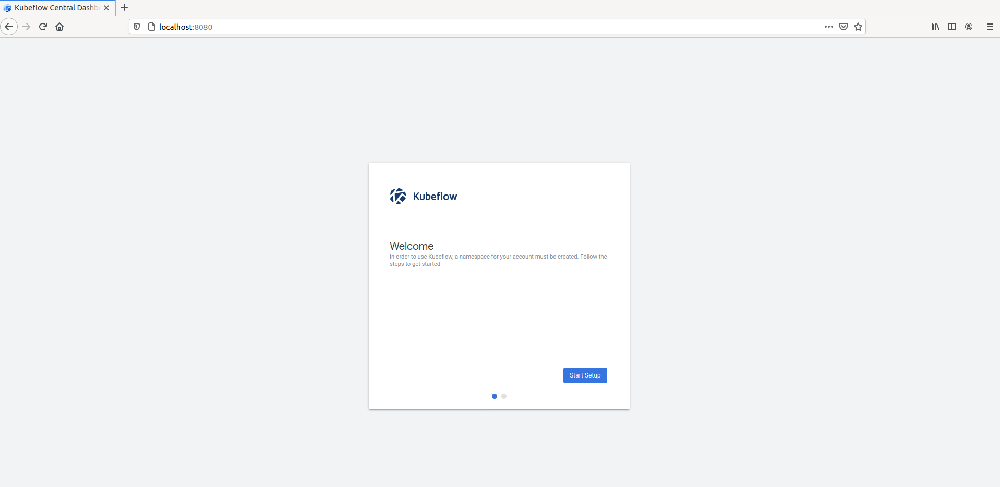

# Setup k8s with az-cli in host docker container

1. Create a k8s service on azure first. 
2. Login docker container in host
3. In container to install the cli tool.
Follow from here: https://docs.microsoft.com/en-us/cli/azure/install-azure-cli-linux?pivots=apt


You can install by my script. 

```
chmod +x install_cli.sh
./install_cli.sh
```

## Steps
```
curl -sL https://aka.ms/InstallAzureCLIDeb | sudo bash
sudo apt-get update
sudo apt-get install ca-certificates curl apt-transport-https lsb-release gnupg
curl -sL https://packages.microsoft.com/keys/microsoft.asc |
    gpg --dearmor |
    sudo tee /etc/apt/trusted.gpg.d/microsoft.gpg > /dev/null

AZ_REPO=$(lsb_release -cs)
echo "deb [arch=amd64] https://packages.microsoft.com/repos/azure-cli/ $AZ_REPO main" |
    sudo tee /etc/apt/sources.list.d/azure-cli.list

sudo apt-get update
sudo apt-get install azure-cli
```

Output:
```
➜  /workspace az login
To sign in, use a web browser to open the page https://microsoft.com/devicelogin and enter the code ---- to authenticate.
```

Then we can test `az` in container
```
➜  /workspace az

Welcome to Azure CLI!
---------------------
Use `az -h` to see available commands or go to https://aka.ms/cli.

Telemetry
---------
The Azure CLI collects usage data in order to improve your experience.
The data is anonymous and does not include commandline argument values.
The data is collected by Microsoft.

You can change your telemetry settings with `az configure`.


     /\
    /  \    _____   _ _  ___ _
   / /\ \  |_  / | | | \'__/ _\
  / ____ \  / /| |_| | | |  __/
 /_/    \_\/___|\__,_|_|  \___|


Welcome to the cool new Azure CLI!
```

# Create a k8s cluster via the az-cli tool on host

```
> az account set --subscription "(Check your info)"
> RESOURCE_GROUP_NAME=KubeTest
> LOCATION=westus
> az group create -n $RESOURCE_GROUP_NAME -l $LOCATION          
{
  "id": "/subscriptions/resourceGroups/KubeTest",
  "location": "westus",
  "managedBy": null,
  "name": "KubeTest",
  "properties": {
    "provisioningState": "Succeeded"
  },
  "tags": null,
  "type": "Microsoft.Resources/resourceGroups"
}

> NAME=KubeTestCluster
> AGENT_SIZE=Standard_D4s_v3
> AGENT_COUNT=2
> RESOURCE_GROUP_NAME=KubeTest
> az aks create -g $RESOURCE_GROUP_NAME -n $NAME -s $AGENT_SIZE -c $AGENT_COUNT -l $LOCATION --generate-ssh-keys 
SSH key files '/home/.ssh/id_rsa' and '/home/.ssh/id_rsa.pub' have been generated under ~/.ssh to allow SSH access to the VM. If using machines without permanent storage like Azure Cloud Shell without an attached file share, back up your keys to a safe location
{/ Finished ..
  "aadProfile": null,
  "addonProfiles": null,
  "agentPoolProfiles": [
    {
      "availabilityZones": null,
      "count": 2,
      "enableAutoScaling": null,
      "enableEncryptionAtHost": false,
      "enableNodePublicIp": false,
      "kubeletConfig": null,
      "kubeletDiskType": "OS",
      "linuxOsConfig": null,
      "maxCount": null,
      "maxPods": 110,
      "minCount": null,
      "mode": "System",
      "name": "nodepool1",
      "nodeImageVersion": "AKSUbuntu-1804gen2containerd-2021.04.22",
      "nodeLabels": {},
      "nodePublicIpPrefixId": null,
      "nodeTaints": null,
      "orchestratorVersion": "1.19.9",
      "osDiskSizeGb": 128,
      "osDiskType": "Managed",
      "osType": "Linux",
      "podSubnetId": null,
      "powerState": {
        "code": "Running"
      },
      "provisioningState": "Succeeded",
      "proximityPlacementGroupId": null,
      "scaleSetEvictionPolicy": null,
      "scaleSetPriority": null,
      "spotMaxPrice": null,
      "tags": null,
      "type": "VirtualMachineScaleSets",
      "upgradeSettings": null,
      "vmSize": "Standard_D4s_v3",
      "vnetSubnetId": null
    }
  ],
  "apiServerAccessProfile": null,
  "autoScalerProfile": null,
  "autoUpgradeProfile": null,
  "azurePortalFqdn": "kubetestcl-kubetest.portal.hcp.westus.azmk8s.io",
  "diskEncryptionSetId": null,
  "dnsPrefix": "KubeTestCl-KubeTest",
  "enablePodSecurityPolicy": null,
  "enableRbac": true,
  "fqdn": "kubetestcl-kubetest.hcp.westus.azmk8s.io",
  "fqdnSubdomain": null,
  },
  "kubernetesVersion": "1.19.9",
  "linuxProfile": {
    "adminUsername": "azureuser",
  "location": "westus",
  "maxAgentPools": 100,
  "name": "KubeTestCluster",
  "networkProfile": {
    "dnsServiceIp": "10.0.0.10",
    "dockerBridgeCidr": "172.17.0.1/16",
    "loadBalancerProfile": {
      "allocatedOutboundPorts": null,
      "effectiveOutboundIps": [
      ],
      "idleTimeoutInMinutes": null,
      "managedOutboundIps": {
        "count": 1
      },
      "outboundIpPrefixes": null,
      "outboundIps": null
    },
    "loadBalancerSku": "Standard",
    "networkMode": null,
    "networkPlugin": "kubenet",
    "networkPolicy": null,
    "outboundType": "loadBalancer",
    "podCidr": "10.244.0.0/16",
    "serviceCidr": "10.0.0.0/16"
  },
  "nodeResourceGroup": "MC_KubeTest_KubeTestCluster_westus",
  "podIdentityProfile": null,
  "powerState": {
    "code": "Running"
  },
  "privateFqdn": null,
  "provisioningState": "Succeeded",
  "resourceGroup": "KubeTest",
  "servicePrincipalProfile": {
    "clientId": "msi",
    "secret": null
  },
  "sku": {
    "name": "Basic",
    "tier": "Free"
  },
  "tags": null,
  "type": "Microsoft.ContainerService/ManagedClusters",
  "windowsProfile": null
}
```
I skip some output information above.

# Kubeflow Installation

# Kubeflow installation 

Follow from here: https://www.kubeflow.org/docs/distributions/azure/deploy/install-kubeflow/

Download the tool from here:
https://github.com/kubeflow/kfctl/releases/tag/v1.2.0


I choose this [kfctl_v1.2.0-0-gbc038f9_linux.tar.gz](https://github.com/kubeflow/kfctl/releases/download/v1.2.0/kfctl_v1.2.0-0-gbc038f9_linux.tar.gz)
extract it:
```
wget https://github.com/kubeflow/kfctl/releases/download/v1.2.0/kfctl_v1.2.0-0-gbc038f9_linux.tar.gz
tar -zxvf kfctl_v1.2.0-0-gbc038f9_linux.tar.gz
```


```
> az aks get-credentials -n $NAME -g $RESOURCE_GROUP_NAME

> pwd
/home/chieh/kf

> export PATH=$PATH:"/home/chieh/kf"
> export KF_NAME="kf-test"
> export BASE_DIR="/home/chieh/kf"
> export KF_DIR=${BASE_DIR}/${KF_NAME}
> export CONFIG_URI="https://raw.githubusercontent.com/kubeflow/manifests/v1.2-branch/kfdef/kfctl_k8s_istio.v1.2.0.yaml"
> mkdir -p ${KF_DIR}
> kfctl apply -V -f ${CONFIG_URI}
```

Output:
```
INFO[0000] Downloading https://raw.githubusercontent.com/kubeflow/manifests/v1.2-branch/kfdef/kfctl_k8s_istio.v1.2.0.yaml to /tmp/340626450/tmp.yaml  filename="utils/k8utils.go:178"
INFO[0000] Downloading https://raw.githubusercontent.com/kubeflow/manifests/v1.2-branch/kfdef/kfctl_k8s_istio.v1.2.0.yaml to /tmp/996879433/tmp_app.yaml  filename="loaders/loaders.go:71"
INFO[0001] App directory /home/chieh/kf/kf-test already exists  filename="coordinator/coordinator.go:270"
INFO[0001] Writing KfDef to kfctl_k8s_istio.v1.2.0.yaml  filename="coordinator/coordinator.go:273"
INFO[0001] No name specified in KfDef.Metadata.Name; defaulting to kf-test based on location of config file: /home/chieh/kf/kf-test/kfctl_k8s_istio.v1.2.0.yaml.  filename="coordinator/coordinator.go:202"
INFO[0001] 
****************************************************************
Notice anonymous usage reporting enabled using spartakus
To disable it
If you have already deployed it run the following commands:
  cd $(pwd)
  kubectl -n ${K8S_NAMESPACE} delete deploy -l app=spartakus

For more info: https://www.kubeflow.org/docs/other-guides/usage-reporting/
****************************************************************

(SKIP)

application.app.k8s.io/spartakus created
INFO[0249] Successfully applied application spartakus    filename="kustomize/kustomize.go:291"
INFO[0249] Applied the configuration Successfully!       filename="cmd/apply.go:75"
```

```
> kubectl get all -n kubeflow

Name
pod/admission-webhook-bootstrap-stateful-set-0               1/1     Running   4          21m
pod/admission-webhook-deployment-5cd7dc96f5-4fwzx            1/1     Running   0          16m
pod/application-controller-stateful-set-0                    1/1     Running   0          23m
pod/argo-ui-65df8c7c84-nlt94                                 1/1     Running   0          20m
pod/cache-deployer-deployment-5f4979f45-5qn6k                1/1     Running   0          20m
pod/cache-server-7859fd67f5-lxdxk                            1/1     Running   0          19m
pod/centraldashboard-67767584dc-bwrsc                        1/1     Running   0          20m
pod/jupyter-web-app-deployment-8486d5ffff-4nswr              1/1     Running   0          20m
pod/katib-controller-7fcc95676b-9fq4g                        1/1     Running   1          20m
pod/katib-db-manager-85db457c64-8x97q                        1/1     Running   3          20m
pod/katib-mysql-6c7f7fb869-xtwn7                             1/1     Running   0          20m
pod/katib-ui-65dc4cf6f5-9pdzv                                1/1     Running   0          20m
pod/kfserving-controller-manager-0                           2/2     Running   0          19m
pod/kubeflow-pipelines-profile-controller-797fb44db9-ffnlk   1/1     Running   0          20m
pod/metacontroller-0                                         1/1     Running   0          21m
pod/metadata-db-6dd978c5b-bnxtf                              1/1     Running   0          20m
pod/metadata-envoy-deployment-67bd5954c-kf6nl                1/1     Running   0          20m
pod/metadata-grpc-deployment-577c67c96f-vfcrq                1/1     Running   5          20m
pod/metadata-writer-756dbdd478-qhwgk                         1/1     Running   3          20m
pod/minio-54d995c97b-fknnn                                   1/1     Running   0          20m
pod/ml-pipeline-7c56db5db9-lg7ln                             1/1     Running   4          20m
pod/ml-pipeline-persistenceagent-d984c9585-42zb6             1/1     Running   1          20m
pod/ml-pipeline-scheduledworkflow-5ccf4c9fcc-cgx4f           1/1     Running   0          20m
pod/ml-pipeline-ui-7ddcd74489-59l2b                          1/1     Running   0          19m
pod/ml-pipeline-viewer-crd-56c68f6c85-8m788                  1/1     Running   0          20m
pod/ml-pipeline-visualizationserver-5b9bd8f6bf-8tv6l         1/1     Running   0          19m
pod/mpi-operator-d5bfb8489-bwc7f                             1/1     Running   0          19m
pod/mxnet-operator-7576d697d6-fs7df                          1/1     Running   0          19m
pod/mysql-74f8f99bc8-2bst4                                   1/1     Running   0          19m
pod/notebook-controller-deployment-5bb6bdbd6d-rwqsp          1/1     Running   0          19m
pod/profiles-deployment-56bc5d7dcb-rbd88                     2/2     Running   0          19m
pod/pytorch-operator-847c8d55d8-snwjl                        1/1     Running   0          19m
pod/seldon-controller-manager-6bf8b45656-jd4vg               1/1     Running   0          19m
pod/spark-operatorsparkoperator-fdfbfd99-h65cv               1/1     Running   0          21m
pod/spartakus-volunteer-558f8bfd47-j528s                     1/1     Running   0          19m
pod/tf-job-operator-58477797f8-rzjx2                         1/1     Running   0          19m
pod/workflow-controller-64fd7cffc5-2t5ln                     1/1     Running   0          19m

NAME                                                   TYPE        CLUSTER-IP     EXTERNAL-IP   PORT(S)             AGE
service/admission-webhook-service                      ClusterIP   10.0.220.105   <none>        443/TCP             20m
service/application-controller-service                 ClusterIP   10.0.27.150    <none>        443/TCP             23m
service/argo-ui                                        NodePort    10.0.50.65     <none>        80:31754/TCP        20m
service/cache-server                                   ClusterIP   10.0.159.104   <none>        443/TCP             20m
service/centraldashboard                               ClusterIP   10.0.0.192     <none>        80/TCP              20m
service/jupyter-web-app-service                        ClusterIP   10.0.76.64     <none>        80/TCP              20m
service/katib-controller                               ClusterIP   10.0.165.19    <none>        443/TCP,8080/TCP    20m
service/katib-db-manager                               ClusterIP   10.0.155.239   <none>        6789/TCP            20m
service/katib-mysql                                    ClusterIP   10.0.139.31    <none>        3306/TCP            20m
service/katib-ui                                       ClusterIP   10.0.204.46    <none>        80/TCP              20m
service/kfserving-controller-manager-metrics-service   ClusterIP   10.0.179.65    <none>        8443/TCP            19m
service/kfserving-controller-manager-service           ClusterIP   10.0.163.108   <none>        443/TCP             19m
service/kfserving-webhook-server-service               ClusterIP   10.0.16.246    <none>        443/TCP             19m
service/kubeflow-pipelines-profile-controller          ClusterIP   10.0.250.67    <none>        80/TCP              20m
service/metadata-db                                    ClusterIP   10.0.68.128    <none>        3306/TCP            20m
service/metadata-envoy-service                         ClusterIP   10.0.157.138   <none>        9090/TCP            20m
service/metadata-grpc-service                          ClusterIP   10.0.199.244   <none>        8080/TCP            20m
service/minio-service                                  ClusterIP   10.0.242.115   <none>        9000/TCP            20m
service/ml-pipeline                                    ClusterIP   10.0.137.212   <none>        8888/TCP,8887/TCP   20m
service/ml-pipeline-ui                                 ClusterIP   10.0.227.216   <none>        80/TCP              20m
service/ml-pipeline-visualizationserver                ClusterIP   10.0.71.206    <none>        8888/TCP            20m
service/mysql                                          ClusterIP   10.0.33.30     <none>        3306/TCP            20m
service/notebook-controller-service                    ClusterIP   10.0.234.171   <none>        443/TCP             20m
service/profiles-kfam                                  ClusterIP   10.0.105.131   <none>        8081/TCP            20m
service/pytorch-operator                               ClusterIP   10.0.224.3     <none>        8443/TCP            20m
service/seldon-webhook-service                         ClusterIP   10.0.237.205   <none>        443/TCP             20m
service/tf-job-operator                                ClusterIP   10.0.249.191   <none>        8443/TCP            20m

NAME                                                    READY   UP-TO-DATE   AVAILABLE   AGE
deployment.apps/admission-webhook-deployment            1/1     1            1           20m
deployment.apps/argo-ui                                 1/1     1            1           20m
deployment.apps/cache-deployer-deployment               1/1     1            1           20m
deployment.apps/cache-server                            1/1     1            1           19m
deployment.apps/centraldashboard                        1/1     1            1           20m
deployment.apps/jupyter-web-app-deployment              1/1     1            1           20m
deployment.apps/katib-controller                        1/1     1            1           20m
deployment.apps/katib-db-manager                        1/1     1            1           20m
deployment.apps/katib-mysql                             1/1     1            1           20m
deployment.apps/katib-ui                                1/1     1            1           20m
deployment.apps/kubeflow-pipelines-profile-controller   1/1     1            1           20m
deployment.apps/metadata-db                             1/1     1            1           20m
deployment.apps/metadata-envoy-deployment               1/1     1            1           20m
deployment.apps/metadata-grpc-deployment                1/1     1            1           20m
deployment.apps/metadata-writer                         1/1     1            1           20m
deployment.apps/minio                                   1/1     1            1           20m
deployment.apps/ml-pipeline                             1/1     1            1           20m
deployment.apps/ml-pipeline-persistenceagent            1/1     1            1           20m
deployment.apps/ml-pipeline-scheduledworkflow           1/1     1            1           20m
deployment.apps/ml-pipeline-ui                          1/1     1            1           19m
deployment.apps/ml-pipeline-viewer-crd                  1/1     1            1           20m
deployment.apps/ml-pipeline-visualizationserver         1/1     1            1           20m
deployment.apps/mpi-operator                            1/1     1            1           20m
deployment.apps/mxnet-operator                          1/1     1            1           19m
deployment.apps/mysql                                   1/1     1            1           19m
deployment.apps/notebook-controller-deployment          1/1     1            1           19m
deployment.apps/profiles-deployment                     1/1     1            1           19m
deployment.apps/pytorch-operator                        1/1     1            1           19m
deployment.apps/seldon-controller-manager               1/1     1            1           19m
deployment.apps/spark-operatorsparkoperator             1/1     1            1           21m
deployment.apps/spartakus-volunteer                     1/1     1            1           19m
deployment.apps/tf-job-operator                         1/1     1            1           19m
deployment.apps/workflow-controller                     1/1     1            1           19m

NAME                                                               DESIRED   CURRENT   READY   AGE
replicaset.apps/admission-webhook-deployment-5cd7dc96f5            1         1         1       20m
replicaset.apps/argo-ui-65df8c7c84                                 1         1         1       20m
replicaset.apps/cache-deployer-deployment-5f4979f45                1         1         1       20m
replicaset.apps/cache-server-7859fd67f5                            1         1         1       19m
replicaset.apps/centraldashboard-67767584dc                        1         1         1       20m
replicaset.apps/jupyter-web-app-deployment-8486d5ffff              1         1         1       20m
replicaset.apps/katib-controller-7fcc95676b                        1         1         1       20m
replicaset.apps/katib-db-manager-85db457c64                        1         1         1       20m
replicaset.apps/katib-mysql-6c7f7fb869                             1         1         1       20m
replicaset.apps/katib-ui-65dc4cf6f5                                1         1         1       20m
replicaset.apps/kubeflow-pipelines-profile-controller-797fb44db9   1         1         1       20m
replicaset.apps/metadata-db-6dd978c5b                              1         1         1       20m
replicaset.apps/metadata-envoy-deployment-67bd5954c                1         1         1       20m
replicaset.apps/metadata-grpc-deployment-577c67c96f                1         1         1       20m
replicaset.apps/metadata-writer-756dbdd478                         1         1         1       20m
replicaset.apps/minio-54d995c97b                                   1         1         1       20m
replicaset.apps/ml-pipeline-7c56db5db9                             1         1         1       20m
replicaset.apps/ml-pipeline-persistenceagent-d984c9585             1         1         1       20m
replicaset.apps/ml-pipeline-scheduledworkflow-5ccf4c9fcc           1         1         1       20m
replicaset.apps/ml-pipeline-ui-7ddcd74489                          1         1         1       19m
replicaset.apps/ml-pipeline-viewer-crd-56c68f6c85                  1         1         1       20m
replicaset.apps/ml-pipeline-visualizationserver-5b9bd8f6bf         1         1         1       20m
replicaset.apps/mpi-operator-d5bfb8489                             1         1         1       20m
replicaset.apps/mxnet-operator-7576d697d6                          1         1         1       19m
replicaset.apps/mysql-74f8f99bc8                                   1         1         1       19m
replicaset.apps/notebook-controller-deployment-5bb6bdbd6d          1         1         1       19m
replicaset.apps/profiles-deployment-56bc5d7dcb                     1         1         1       19m
replicaset.apps/pytorch-operator-847c8d55d8                        1         1         1       19m
replicaset.apps/seldon-controller-manager-6bf8b45656               1         1         1       19m
replicaset.apps/spark-operatorsparkoperator-fdfbfd99               1         1         1       21m
replicaset.apps/spartakus-volunteer-558f8bfd47                     1         1         1       19m
replicaset.apps/tf-job-operator-58477797f8                         1         1         1       19m
replicaset.apps/workflow-controller-64fd7cffc5                     1         1         1       19m

NAME                                                        READY   AGE
statefulset.apps/admission-webhook-bootstrap-stateful-set   1/1     21m
statefulset.apps/application-controller-stateful-set        1/1     23m
statefulset.apps/kfserving-controller-manager               1/1     19m
statefulset.apps/metacontroller                             1/1     21m

```

Forword the port
```
> kubectl port-forward svc/istio-ingressgateway -n istio-system 8080:80
Forwarding from 127.0.0.1:8080 -> 80
Forwarding from [::1]:8080 -> 80
Handling connection for 8080
```
Check on browser: `http://localhost:8080`



Work!!!