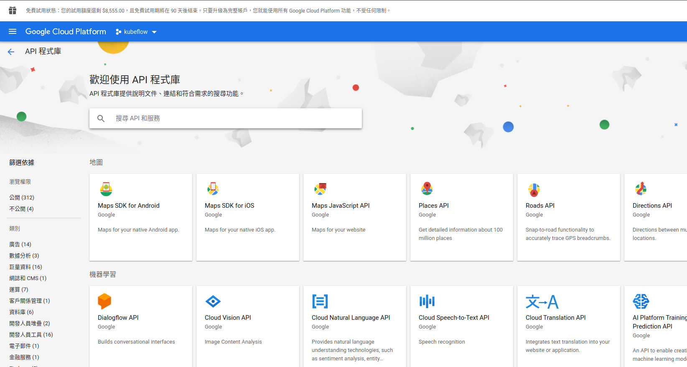
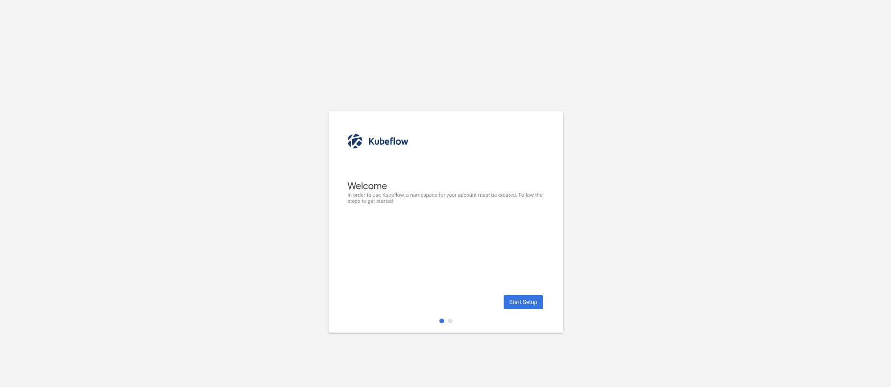
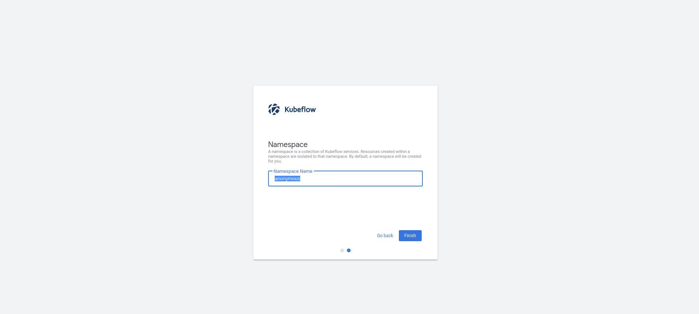
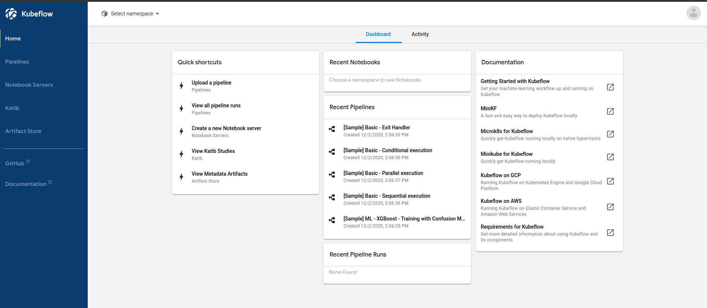
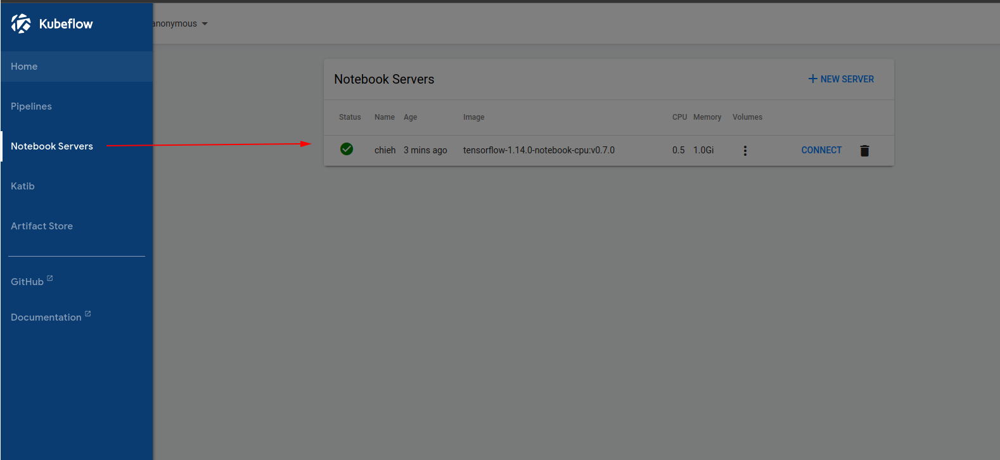
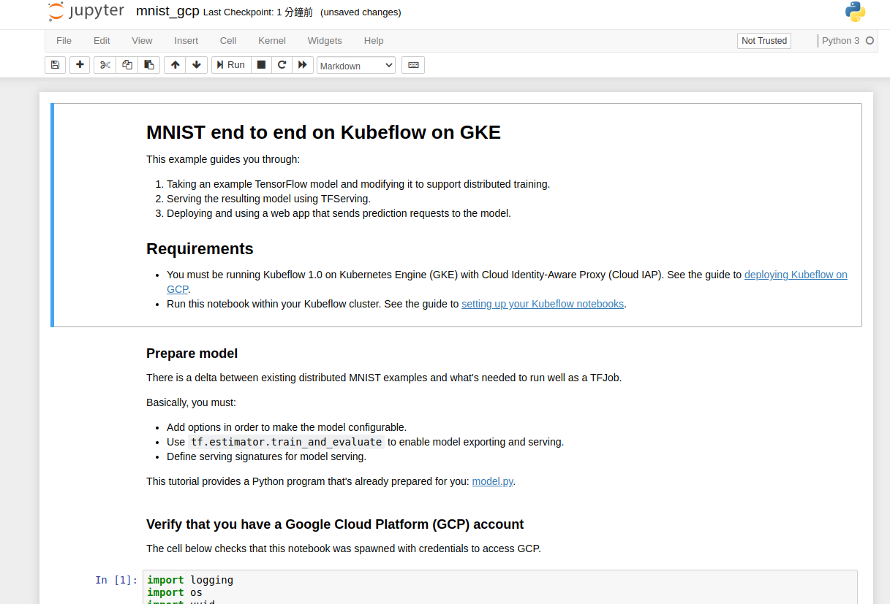
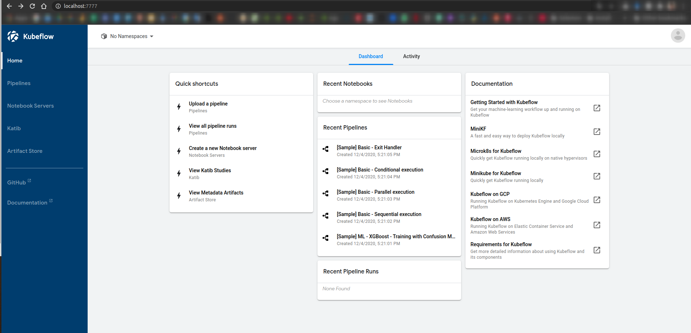

# Install Kubeflow

All source from : [Official tutorial](https://www.kubeflow.org/docs/pipelines/installation/localcluster-deployment/)

```
$ kind get clusters
kind

$ kind version
kind v0.9.0 go1.15.2 linux/amd64
```

Creating a cluster on kind
```
kind create cluster
```

This will bootstrap a Kubernetes cluster using a pre-built node image.
You can find that image on the Docker Hub kindest/node here.
If you wish to build the node image yourself, you can use the kind build node-image command—see the official building image section for more details. And, to specify another image, use the --image flag.

By default, the cluster will be given the name kind. Use the --name flag to assign the cluster a different context name.

### Deploying Kubeflow Pipelines

To deploy the Kubeflow Pipelines, run the following commands:
```
export PIPELINE_VERSION=1.0.4
kubectl apply -k "github.com/kubeflow/pipelines/manifests/kustomize/cluster-scoped-resources?ref=$PIPELINE_VERSION"
```
Output:
```
namespace/kubeflow created
Warning: apiextensions.k8s.io/v1beta1 CustomResourceDefinition is deprecated in v1.16+, unavailable in v1.22+; use apiextensions.k8s.io/v1 CustomResourceDefinition
customresourcedefinition.apiextensions.k8s.io/applications.app.k8s.io created
customresourcedefinition.apiextensions.k8s.io/clusterworkflowtemplates.argoproj.io created
customresourcedefinition.apiextensions.k8s.io/cronworkflows.argoproj.io created
customresourcedefinition.apiextensions.k8s.io/scheduledworkflows.kubeflow.org created
customresourcedefinition.apiextensions.k8s.io/viewers.kubeflow.org created
customresourcedefinition.apiextensions.k8s.io/workflows.argoproj.io created
customresourcedefinition.apiextensions.k8s.io/workflowtemplates.argoproj.io created
serviceaccount/kubeflow-pipelines-cache-deployer-sa created
clusterrole.rbac.authorization.k8s.io/kubeflow-pipelines-cache-deployer-clusterrole created
clusterrolebinding.rbac.authorization.k8s.io/kubeflow-pipelines-cache-deployer-clusterrolebinding created
```
Commands:
```
kubectl wait --for condition=established --timeout=60s crd/applications.app.k8s.io
kubectl apply -k "github.com/kubeflow/pipelines/manifests/kustomize/env/platform-agnostic-pns?ref=$PIPELINE_VERSION"
```
Output:
```
serviceaccount/application created
serviceaccount/argo created
serviceaccount/kubeflow-pipelines-cache created
serviceaccount/kubeflow-pipelines-container-builder created
serviceaccount/kubeflow-pipelines-metadata-writer created
serviceaccount/kubeflow-pipelines-viewer created
serviceaccount/ml-pipeline-persistenceagent created
serviceaccount/ml-pipeline-scheduledworkflow created
serviceaccount/ml-pipeline-ui created
serviceaccount/ml-pipeline-viewer-crd-service-account created
serviceaccount/ml-pipeline-visualizationserver created
serviceaccount/ml-pipeline created
serviceaccount/pipeline-runner created
role.rbac.authorization.k8s.io/application-manager-role created
role.rbac.authorization.k8s.io/argo-role created
role.rbac.authorization.k8s.io/kubeflow-pipelines-cache-deployer-role created
role.rbac.authorization.k8s.io/kubeflow-pipelines-cache-role created
role.rbac.authorization.k8s.io/kubeflow-pipelines-metadata-writer-role created
role.rbac.authorization.k8s.io/ml-pipeline-persistenceagent-role created
role.rbac.authorization.k8s.io/ml-pipeline-scheduledworkflow-role created
role.rbac.authorization.k8s.io/ml-pipeline-ui created
role.rbac.authorization.k8s.io/ml-pipeline-viewer-controller-role created
role.rbac.authorization.k8s.io/ml-pipeline created
role.rbac.authorization.k8s.io/pipeline-runner created
rolebinding.rbac.authorization.k8s.io/application-manager-rolebinding created
rolebinding.rbac.authorization.k8s.io/argo-binding created
rolebinding.rbac.authorization.k8s.io/kubeflow-pipelines-cache-binding created
rolebinding.rbac.authorization.k8s.io/kubeflow-pipelines-cache-deployer-rolebinding created
rolebinding.rbac.authorization.k8s.io/kubeflow-pipelines-metadata-writer-binding created
rolebinding.rbac.authorization.k8s.io/ml-pipeline-persistenceagent-binding created
rolebinding.rbac.authorization.k8s.io/ml-pipeline-scheduledworkflow-binding created
rolebinding.rbac.authorization.k8s.io/ml-pipeline-ui created
rolebinding.rbac.authorization.k8s.io/ml-pipeline-viewer-crd-binding created
rolebinding.rbac.authorization.k8s.io/ml-pipeline created
rolebinding.rbac.authorization.k8s.io/pipeline-runner-binding created
configmap/metadata-grpc-configmap created
configmap/ml-pipeline-ui-configmap created
configmap/pipeline-install-config-7t84h8df7d created
configmap/workflow-controller-configmap created
secret/mlpipeline-minio-artifact created
secret/mysql-secret-fd5gktm75t created
service/cache-server created
service/controller-manager-service created
service/metadata-envoy-service created
service/metadata-grpc-service created
service/minio-service created
service/ml-pipeline-ui created
service/ml-pipeline-visualizationserver created
service/ml-pipeline created
service/mysql created
deployment.apps/cache-deployer-deployment created
deployment.apps/cache-server created
deployment.apps/controller-manager created
deployment.apps/metadata-envoy-deployment created
deployment.apps/metadata-grpc-deployment created
deployment.apps/metadata-writer created
deployment.apps/minio created
deployment.apps/ml-pipeline-persistenceagent created
deployment.apps/ml-pipeline-scheduledworkflow created
deployment.apps/ml-pipeline-ui created
deployment.apps/ml-pipeline-viewer-crd created
deployment.apps/ml-pipeline-visualizationserver created
deployment.apps/ml-pipeline created
deployment.apps/mysql created
deployment.apps/workflow-controller created
application.app.k8s.io/pipeline created
persistentvolumeclaim/minio-pvc created
persistentvolumeclaim/mysql-pv-claim created
```

The Kubeflow Pipelines deployment may take several minutes to complete.

```
kubectl port-forward -n kubeflow svc/ml-pipeline-ui 8080:80
```

Output: 
```
Forwarding from 127.0.0.1:8080 -> 3000
Forwarding from [::1]:8080 -> 3000
E1027 16:19:07.906784  796197 portforward.go:233] lost connection to pod
```

---
# Update - try on GCP

Followed the instructions from [Set up a Google Cloud Project](https://www.kubeflow.org/docs/gke/deploy/project-setup/).

1. Create a project

2. Go to enable these APIs below from here.
  

* [Compute Engine API](https://console.cloud.google.com/apis/library/compute.googleapis.com)
* [Kubernetes Engine API](https://console.cloud.google.com/apis/library/container.googleapis.com)
* [Identity and Access Management (IAM) API](https://console.cloud.google.com/apis/library/iam.googleapis.com)
* [Service Management API](https://console.cloud.google.com/apis/api/servicemanagement.googleapis.com)
* [Cloud Resource Manager API](https://console.developers.google.com/apis/library/cloudresourcemanager.googleapis.com)
* [AI Platform Training & Prediction API](https://console.developers.google.com/apis/library/ml.googleapis.com)
* [Cloud Build API](https://console.cloud.google.com/apis/library/cloudbuild.googleapis.com) (It’s required if you plan to use [Fairing](https://www.kubeflow.org/docs/components/fairing/) in your Kubeflow cluster)

Of course, you can use commands on cloud shell.
```
gcloud services enable \
  compute.googleapis.com \
  container.googleapis.com \
  iam.googleapis.com \
  servicemanagement.googleapis.com \
  cloudresourcemanager.googleapis.com \
  ml.googleapis.com

# Cloud Build API is optional, you need it if using Fairing.
# gcloud services enable cloudbuild.googleapis.com
```

3. Please do anything via cloud shell and you can follow here. https://www.kubeflow.org/docs/started/k8s/kfctl-k8s-istio/ for prepare your environment.
But the differences are listed below:

- Use this version `v1.0-rc.1` : https://github.com/kubeflow/kfctl/releases/tag/v1.0-rc.1
- export CONFIG_URI="https://raw.githubusercontent.com/kubeflow/manifests/v0.7-branch/kfdef/kfctl_k8s_istio.0.7.1.yaml"
- the cluster of kubectl version : `v1.15.12` (Actually dont use over v1.15 version) (i.e., v1.16 cannot work)

---
## Error 

Run on cloud shell with kubectl **v1.16**
```
***************************************************************
Notice anonymous usage reporting enabled using spartakus
To disable it
If you have already deployed it run the following commands:
  cd $(pwd)
  kubectl -n ${K8S_NAMESPACE} delete deploy -l app=spartakus

For more info: https://www.kubeflow.org/docs/other-guides/usage-reporting/
****************************************************************
```

```
WARN[0305] Encountered error during apply:  (kubeflow.error): Code 500 with message: Apply.Run  Error error when creating "/tmp/kout162494271": CustomResourceDefinition.apiextensions.k8s.io "seldondeployments.machinelearning.seldon.io" is invalid: [spec.validation.openAPIV3Schema.properties[spec].properties[predictors].items.properties[explainer].properties[endpoint].type: Required value: must not be empty for specified object fields, spec.validation.openAPIV3Schema.properties[spec].properties[predictors].items.properties[graph].properties[children].items.properties[children].items.properties[children].items.type: Required value: must not be empty for specified array items, spec.validation.openAPIV3Schema.properties[spec].properties[predictors].items.properties[graph].properties[children].items.properties[children].items.properties[endpoint].type: Required value: must not be empty for specified object fields, spec.validation.openAPIV3Schema.properties[spec].properties[predictors].items.properties[graph].properties[children].items.properties[children].items.type: Required value: must not be empty for specified array items, spec.validation.openAPIV3Schema.properties[spec].properties[predictors].items.properties[graph].properties[children].items.properties[endpoint].type: Required value: must not be empty for specified object fields, spec.validation.openAPIV3Schema.properties[spec].properties[predictors].items.properties[graph].properties[children].items.type: Required value: must not be empty for specified array items, spec.validation.openAPIV3Schema.properties[spec].properties[predictors].items.properties[graph].properties[endpoint].type: Required value: must not be empty for specified object fields, spec.validation.openAPIV3Schema.properties[spec].properties[predictors].items.properties[graph].type: Required value: must not be empty for specified object fields, spec.validation.openAPIV3Schema.properties[spec].properties[predictors].items.properties[svcOrchSpec].properties[env].items.properties[valueFrom].properties[configMapKeyRef].type: Required value: must not be empty for specified object fields, spec.validation.openAPIV3Schema.properties[spec].properties[predictors].items.properties[svcOrchSpec].properties[env].items.properties[valueFrom].properties[fieldRef].type: Required value: must not be empty for specified object fields, spec.validation.openAPIV3Schema.properties[spec].properties[predictors].items.properties[svcOrchSpec].properties[env].items.properties[valueFrom].properties[resourceFieldRef].type: Required value: must not be empty for specified object fields, spec.validation.openAPIV3Schema.properties[spec].properties[predictors].items.properties[svcOrchSpec].properties[env].items.properties[valueFrom].properties[secretKeyRef].type: Required value: must not be empty for specified object fields, spec.validation.openAPIV3Schema.properties[spec].properties[predictors].items.properties[svcOrchSpec].properties[env].items.properties[valueFrom].type: Required value: must not be empty for specified object fields, spec.validation.openAPIV3Schema.properties[spec].properties[predictors].items.properties[svcOrchSpec].properties[env].items.type: Required value: must not be empty for specified array items, spec.validation.openAPIV3Schema.properties[spec].properties[predictors].items.properties[svcOrchSpec].properties[resources].type: Required value: must not be empty for specified object fields, spec.validation.openAPIV3Schema.properties[spec].properties[predictors].items.type: Required value: must not be empty for specified array items, spec.validation.openAPIV3Schema.properties[spec].type: Required value: must not be empty for specified object fields, spec.validation.openAPIV3Schema.type: Required value: must not be empty at the root]  filename="kustomize/kustomize.go:193"
```

The reason is because of the version of cluster which was used v1.16.

---
## Downgrade the version of kubectl to v1.15.12

After I downgraded to `v1.15.12`, it could succeeded.
```
chiehtsaiphysicist@cloudshell:~/kf-test-11 (kubeflow-297403)$ kubectl version
Client Version: version.Info{Major:"1", Minor:"19", GitVersion:"v1.19.4", GitCommit:"d360454c9bcd1634cf4cc52d1867af5491dc9c5f", GitTreeState:"clean", BuildDate:"2020-11-11T13:17:17Z", GoVersion:"go1.15.2", Compiler:"gc", Platform:"linux/amd64"}
Server Version: version.Info{Major:"1", Minor:"15+", GitVersion:"v1.15.12-gke.20", GitCommit:"0ac5f81eecab42bff5ef74f18b99d8896ba7b89b", GitTreeState:"clean", BuildDate:"2020-09-09T00:48:20Z", GoVersion:"go1.12.17b4", Compiler:"gc", Platform:"linux/amd64"}
```

Finally ...
```
serviceaccount/seldon-manager created
clusterrole.rbac.authorization.k8s.io/seldon-operator-manager-role created
clusterrolebinding.rbac.authorization.k8s.io/seldon-operator-manager-rolebinding created
configmap/seldon-config created
secret/seldon-operator-webhook-server-secret created
service/seldon-operator-controller-manager-service created
service/webhook-server-service created
statefulset.apps/seldon-operator-controller-manager created
application.app.k8s.io/seldon-core-operator created
INFO[0257] Applied the configuration Successfully!       filename="cmd/apply.go:72"
```

Check pod whether it can deploy successfully.
```
kubectl get po -n kubeflow
```
Output:
```
NAME                                                           READY   STATUS    RESTARTS   AGE
admission-webhook-bootstrap-stateful-set-0                     1/1     Running   0          6m31s
admission-webhook-deployment-b7d89f4c7-vjvs5                   1/1     Running   0          5m32s
application-controller-stateful-set-0                          1/1     Running   0          6m51s
argo-ui-6754c76f9b-8g766                                       1/1     Running   0          6m42s
centraldashboard-5578cc9569-c97c2                              1/1     Running   0          6m34s
jupyter-web-app-deployment-6b7d9c5fd6-wz9dj                    1/1     Running   0          6m21s
katib-controller-789d76d446-vgcnb                              1/1     Running   1          5m3s
katib-db-75975d8dbd-jkvfr                                      1/1     Running   0          5m2s
katib-manager-59bb84948f-r988j                                 1/1     Running   0          5m1s
katib-ui-dd75bd446-g8q67                                       1/1     Running   0          5m1s
kfserving-controller-manager-0                                 2/2     Running   1          5m26s
metacontroller-0                                               1/1     Running   0          6m47s
metadata-db-7584d44b65-5sfgn                                   1/1     Running   0          6m14s
metadata-deployment-cd8f7d58f-6dcp6                            1/1     Running   0          6m13s
metadata-envoy-deployment-bff4f8b9-ctfwc                       1/1     Running   0          6m13s
metadata-grpc-deployment-7cc5d84854-g59g2                      1/1     Running   4          6m12s
metadata-ui-7c978889b5-67kvb                                   1/1     Running   0          6m12s
minio-764648495-rgtfz                                          1/1     Running   0          4m53s
ml-pipeline-588b64fff-8lpdp                                    1/1     Running   0          4m56s
ml-pipeline-ml-pipeline-visualizationserver-6c7c97869d-k8mhk   1/1     Running   0          4m31s
ml-pipeline-persistenceagent-79ff896578-v6lw4                  1/1     Running   0          4m48s
ml-pipeline-scheduledworkflow-7d89bb6db5-7hw6d                 1/1     Running   0          4m32s
ml-pipeline-ui-6656886579-gg944                                1/1     Running   0          4m42s
ml-pipeline-viewer-controller-deployment-546bd5f545-gl7v2      1/1     Running   0          4m37s
mysql-6c9cb88c4d-ckchq                                         1/1     Running   0          4m50s
notebook-controller-deployment-6d594ddd6b-7jw9c                1/1     Running   0          6m5s
profiles-deployment-67799585bd-5wxwp                           2/2     Running   0          4m27s
pytorch-operator-fdfd7985-f6w8q                                1/1     Running   0          6m1s
seldon-operator-controller-manager-0                           1/1     Running   1          4m19s
spartakus-volunteer-5888bc655-kwfsd                            1/1     Running   0          5m23s
tensorboard-5f685f9d79-5nrzd                                   1/1     Running   0          5m21s
tf-job-operator-5dff84b966-rzmtl                               1/1     Running   0          5m15s
workflow-controller-85c665bcb9-vnm2h                           1/1     Running   0          6m41s
```

Check whether istio status is.
```
chiehtsaiphysicist@cloudshell:~/kf-test-11 (kubeflow-297403)$ kubectl get po -n istio-system
NAME                                      READY   STATUS      RESTARTS   AGE
grafana-86f89dbd84-89p5t                  1/1     Running     0          8m4s
istio-citadel-74966f47d6-r927d            1/1     Running     0          8m4s
istio-cleanup-secrets-1.1.6-5jvdl         0/1     Completed   0          7m53s
istio-egressgateway-5c64d575bc-khjhm      1/1     Running     0          8m3s
istio-egressgateway-5c64d575bc-nqqcs      1/1     Running     0          5m4s
istio-galley-784b9f6d75-fxgw2             1/1     Running     0          8m3s
istio-grafana-post-install-1.1.6-fssv7    0/1     Completed   0          7m52s
istio-ingressgateway-589ff776dd-b828z     1/1     Running     0          8m2s
istio-ingressgateway-589ff776dd-x2vvz     1/1     Running     0          4m33s
istio-pilot-677df6b6d4-4h9sl              2/2     Running     0          8m2s
istio-pilot-677df6b6d4-dp6tp              2/2     Running     0          4m49s
istio-pilot-677df6b6d4-mpx7x              2/2     Running     0          5m3s
istio-pilot-677df6b6d4-nbmt2              2/2     Running     0          5m2s
istio-pilot-677df6b6d4-rr4jh              2/2     Running     0          5m2s
istio-policy-6f74d9d95d-cr6f6             2/2     Running     2          8m1s
istio-security-post-install-1.1.6-vxvrd   0/1     Completed   0          7m52s
istio-sidecar-injector-866f4b98c7-65sw6   1/1     Running     0          8m1s
istio-telemetry-549c8f9dcb-6wccl          2/2     Running     2          8m
istio-tracing-555cf644d-nx4pz             1/1     Running     0          8m
kiali-7db44d6dfb-v88s6                    1/1     Running     0          7m59s
prometheus-d44645598-v7ghg                1/1     Running     0          7m59s
```

---
## Create Service Account

```
gcloud iam service-accounts create gcp-sa # $GSA_NAME
kubectl create serviceaccount --namespace kubeflow k8s-sa # $KSA_NAME

gcloud iam service-accounts add-iam-policy-binding   --role roles/iam.workloadIdentityUser   --member "serviceAccount:kubeflow-297403.svc.id.goog[kubeflow/k8s-sa]"   gcp-sa@kubeflow-297403.iam.gserviceaccount.com

kubectl annotate serviceaccount \
  --namespace kubeflow \
  k8s-sa \
  iam.gke.io/gcp-service-account=gcp-sa]@kubeflow-297403.iam.gserviceaccount.com
```

Until this part, the Kubeflow was deployed done!

---
## Start KubeFlow

```
kubectl port-forward svc/istio-ingressgateway -n istio-system 8080:80
```

 
 


We can test this example of mnist on gcp.
Download from here: `git clone https://github.com/kubeflow/examples.git git_kubeflow-examples`



---
## Run mnist example

#### Error 1
When we run on this line, we can use `pip` to install it.

```
ImportError: You need to install 'msrestazure' to use this feature
```

Ref: https://github.com/kubeflow/examples/issues/828

#### Error 2
```
AttributeError: module 'tornado.ioloop' has no attribute '_Selectable'
```
Try to use this version `tornado>=6.0.3`


---
# Deploy Kubeflow on local via minikube
## Pass the kfctl apply stage and successfully access the dashboard!
**Create a cluster via VM!**
```
~ ›› minikube start --kubernetes-version v1.15.12                                                                                                                                     
😄  minikube v1.14.1 on Ubuntu 18.04
✨  Automatically selected the docker driver
👍  Starting control plane node minikube in cluster minikube
🔥  Creating docker container (CPUs=2, Memory=8000MB) ...
✋  Stopping node "minikube"  ...
🛑  Powering off "minikube" via SSH ...
🔥  Deleting "minikube" in docker ...
🤦  StartHost failed, but will try again: creating host: create: provisioning: ssh command error:
command : sudo hostname minikube && echo "minikube" | sudo tee /etc/hostname
err     : Process exited with status 1
output  : sudo: effective uid is not 0, is /usr/bin/sudo on a file system with the 'nosuid' option set or an NFS file system without root privileges?

🔥  Creating docker container (CPUs=2, Memory=8000MB) ...
😿  Failed to start docker container. Running "minikube delete" may fix it: creating host: create: provisioning: ssh command error:
command : sudo hostname minikube && echo "minikube" | sudo tee /etc/hostname
err     : Process exited with status 1
output  : sudo: effective uid is not 0, is /usr/bin/sudo on a file system with the 'nosuid' option set or an NFS file system without root privileges?

❗  Startup with docker driver failed, trying with alternate driver virtualbox: Failed to start host: creating host: create: provisioning: ssh command error:
command : sudo hostname minikube && echo "minikube" | sudo tee /etc/hostname
err     : Process exited with status 1
output  : sudo: effective uid is not 0, is /usr/bin/sudo on a file system with the 'nosuid' option set or an NFS file system without root privileges?

🔥  Deleting "minikube" in docker ...
🔥  Deleting container "minikube" ...
🔥  Removing /home/chieh/.minikube/machines/minikube ...
💀  Removed all traces of the "minikube" cluster.
💿  Downloading VM boot image ...
    > minikube-v1.14.0.iso.sha256: 65 B / 65 B [-------------] 100.00% ? p/s 0s
    > minikube-v1.14.0.iso: 178.27 MiB / 178.27 MiB [ 100.00% 11.02 MiB p/s 17s
👍  Starting control plane node minikube in cluster minikube
🔥  Creating virtualbox VM (CPUs=2, Memory=6000MB, Disk=20000MB) ...
🐳  Preparing Kubernetes v1.15.12 on Docker 19.03.12 ...
🔎  Verifying Kubernetes components...
🌟  Enabled addons: storage-provisioner, default-storageclass
🏄  Done! kubectl is now configured to use "minikube" by default

```

**Use kfctl v1.0**
```
wget https://github.com/kubeflow/kfctl/releases/download/v1.0-rc.1/kfctl_v1.0-rc.1-0-g963c787_linux.tar.gz
```

**Use kfctl_k8s_istio.0.7.1.yaml**
```
kf_test10 ›› export CONFIG_URI="https://raw.githubusercontent.com/kubeflow/manifests/v0.7-branch/kfdef/kfctl_k8s_istio.0.7.1.yaml"            
```

**kfctl apply**
```                                        
kf_test10 ›› kfctl apply -V -f ${CONFIG_URI}                                                                                                                                          
INFO[0000] Downloading https://raw.githubusercontent.com/kubeflow/manifests/v0.7-branch/kfdef/kfctl_k8s_istio.0.7.1.yaml to /tmp/704589051/tmp.yaml  filename="utils/k8utils.go:172"
INFO[0000] Downloading https://raw.githubusercontent.com/kubeflow/manifests/v0.7-branch/kfdef/kfctl_k8s_istio.0.7.1.yaml to /tmp/693838366/tmp_app.yaml  filename="loaders/loaders.go:71"
INFO[0001] App directory /home/chieh/kubeflow_use/kf_test10 already exists  filename="coordinator/coordinator.go:270"
INFO[0001] Writing KfDef to kfctl_k8s_istio.0.7.1.yaml   filename="coordinator/coordinator.go:273"
INFO[0001] No name specified in KfDef.Metadata.Name; defaulting to kf_test10 based on location of config file: /home/chieh/kubeflow_use/kf_test10/kfctl_k8s_istio.0.7.1.yaml.  filename="coordinator/coordinator.go:202"
INFO[0001] 
****************************************************************
Notice anonymous usage reporting enabled using spartakus
To disable it
If you have already deployed it run the following commands:
  cd $(pwd)
  kubectl -n ${K8S_NAMESPACE} delete deploy -l app=spartakus

For more info: https://www.kubeflow.org/docs/other-guides/usage-reporting/
****************************************************************

(PASS)

serviceaccount/ml-pipeline-scheduledworkflow created
role.rbac.authorization.k8s.io/ml-pipeline-scheduledworkflow created
clusterrole.rbac.authorization.k8s.io/kubeflow-scheduledworkflows-admin created
clusterrole.rbac.authorization.k8s.io/kubeflow-scheduledworkflows-edit created
clusterrole.rbac.authorization.k8s.io/kubeflow-scheduledworkflows-view created
clusterrolebinding.rbac.authorization.k8s.io/ml-pipeline-scheduledworkflow created
deployment.apps/ml-pipeline-scheduledworkflow created
application.app.k8s.io/scheduledworkflow created
service/ml-pipeline-ml-pipeline-visualizationserver created
deployment.apps/ml-pipeline-ml-pipeline-visualizationserver created
application.app.k8s.io/pipeline-visualization-service created
customresourcedefinition.apiextensions.k8s.io/profiles.kubeflow.org created
serviceaccount/profiles-controller-service-account created
clusterrolebinding.rbac.authorization.k8s.io/profiles-cluster-role-binding created
configmap/profiles-profiles-parameters-5c86m8kfb8 created
service/profiles-kfam created
deployment.apps/profiles-deployment created
application.app.k8s.io/profiles created
virtualservice.networking.istio.io/kfam created
customresourcedefinition.apiextensions.k8s.io/seldondeployments.machinelearning.seldon.io created
serviceaccount/seldon-manager created
clusterrole.rbac.authorization.k8s.io/seldon-operator-manager-role created
clusterrolebinding.rbac.authorization.k8s.io/seldon-operator-manager-rolebinding created
configmap/seldon-config created
secret/seldon-operator-webhook-server-secret created
service/seldon-operator-controller-manager-service created
service/webhook-server-service created
statefulset.apps/seldon-operator-controller-manager created
application.app.k8s.io/seldon-core-operator created
INFO[0033] Applied the configuration Successfully!       filename="cmd/apply.go:72"
```


```
kf_test10 ›› kubectl -n kubeflow get all                                                                                                                                              


NAME                                                               READY   STATUS              RESTARTS   AGE
pod/admission-webhook-bootstrap-stateful-set-0                     0/1     ContainerCreating   0          28s
pod/admission-webhook-deployment-b7d89f4c7-wrq6f                   0/1     ContainerCreating   0          17s
pod/application-controller-stateful-set-0                          0/1     ContainerCreating   0          31s
pod/argo-ui-6754c76f9b-8kkwx                                       0/1     ContainerCreating   0          29s
pod/centraldashboard-5578cc9569-lhlzt                              0/1     ContainerCreating   0          28s
pod/jupyter-web-app-deployment-6b7d9c5fd6-wzx27                    0/1     ContainerCreating   0          25s
pod/katib-controller-789d76d446-nn4ll                              0/1     ContainerCreating   0          10s
pod/katib-db-75975d8dbd-w8r2g                                      0/1     ContainerCreating   0          10s
pod/katib-manager-59bb84948f-5dmb5                                 0/1     ContainerCreating   0          10s
pod/katib-ui-dd75bd446-pdjt8                                       0/1     ContainerCreating   0          10s
pod/kfserving-controller-manager-0                                 0/2     ContainerCreating   0          15s
pod/metacontroller-0                                               0/1     ContainerCreating   0          29s
pod/metadata-db-7584d44b65-dztxc                                   0/1     ContainerCreating   0          25s
pod/metadata-deployment-cd8f7d58f-jzltz                            0/1     ContainerCreating   0          25s
pod/metadata-envoy-deployment-bff4f8b9-gs762                       0/1     ContainerCreating   0          25s
pod/metadata-grpc-deployment-7cc5d84854-vq59p                      0/1     ContainerCreating   0          24s
pod/metadata-ui-7c978889b5-tbk4x                                   0/1     ContainerCreating   0          23s
pod/minio-764648495-kvczk                                          0/1     ContainerCreating   0          9s
pod/ml-pipeline-588b64fff-xs2rx                                    0/1     ContainerCreating   0          9s
pod/ml-pipeline-ml-pipeline-visualizationserver-6c7c97869d-546pr   0/1     Pending             0          6s
pod/ml-pipeline-persistenceagent-79ff896578-9bvns                  0/1     ContainerCreating   0          9s
pod/ml-pipeline-scheduledworkflow-7d89bb6db5-xx24f                 0/1     ContainerCreating   0          6s
pod/ml-pipeline-ui-6656886579-p8tc5                                0/1     ContainerCreating   0          8s
pod/ml-pipeline-viewer-controller-deployment-546bd5f545-9r8r6      0/1     ContainerCreating   0          7s
pod/mysql-6c9cb88c4d-5h25j                                         0/1     ContainerCreating   0          9s
pod/notebook-controller-deployment-6d594ddd6b-xrgwq                0/1     ContainerCreating   0          23s
pod/profiles-deployment-67799585bd-wwmpg                           0/2     Pending             0          5s
pod/pytorch-operator-fdfd7985-t9824                                0/1     ContainerCreating   0          23s
pod/seldon-operator-controller-manager-0                           0/1     ContainerCreating   0          7s
pod/spartakus-volunteer-5888bc655-w2f66                            0/1     ContainerCreating   0          14s
pod/tensorboard-5f685f9d79-clk4g                                   0/1     Pending             0          14s
pod/tf-job-operator-5dff84b966-xbn6n                               0/1     ContainerCreating   0          13s
pod/workflow-controller-85c665bcb9-q6vt5                           0/1     ContainerCreating   0          29s


NAME                                                   TYPE        CLUSTER-IP       EXTERNAL-IP   PORT(S)             AGE
service/admission-webhook-service                      ClusterIP   10.107.160.105   <none>        443/TCP             27s
service/application-controller-service                 ClusterIP   10.102.97.247    <none>        443/TCP             31s
service/argo-ui                                        NodePort    10.110.120.111   <none>        80:30796/TCP        29s
service/centraldashboard                               ClusterIP   10.105.149.236   <none>        80/TCP              28s
service/jupyter-web-app-service                        ClusterIP   10.109.145.77    <none>        80/TCP              26s
service/katib-controller                               ClusterIP   10.110.26.202    <none>        443/TCP             13s
service/katib-db                                       ClusterIP   10.100.193.26    <none>        3306/TCP            13s
service/katib-manager                                  ClusterIP   10.98.54.159     <none>        6789/TCP            12s
service/katib-ui                                       ClusterIP   10.110.72.234    <none>        80/TCP              12s
service/kfserving-controller-manager-metrics-service   ClusterIP   10.111.64.89     <none>        8443/TCP            17s
service/kfserving-controller-manager-service           ClusterIP   10.99.252.103    <none>        443/TCP             17s
service/metadata-db                                    ClusterIP   10.98.29.178     <none>        3306/TCP            26s
service/metadata-envoy-service                         ClusterIP   10.98.237.56     <none>        9090/TCP            26s
service/metadata-grpc-service                          ClusterIP   10.107.22.226    <none>        8080/TCP            26s
service/metadata-service                               ClusterIP   10.99.86.171     <none>        8080/TCP            26s
service/metadata-ui                                    ClusterIP   10.101.0.164     <none>        80/TCP              26s
service/minio-service                                  ClusterIP   10.99.107.7      <none>        9000/TCP            12s
service/ml-pipeline                                    ClusterIP   10.97.4.244      <none>        8888/TCP,8887/TCP   12s
service/ml-pipeline-ml-pipeline-visualizationserver    ClusterIP   10.104.126.110   <none>        8888/TCP            11s
service/ml-pipeline-tensorboard-ui                     ClusterIP   10.104.147.57    <none>        80/TCP              11s
service/ml-pipeline-ui                                 ClusterIP   10.102.121.82    <none>        80/TCP              11s
service/mysql                                          ClusterIP   10.100.43.123    <none>        3306/TCP            12s
service/notebook-controller-service                    ClusterIP   10.106.253.18    <none>        443/TCP             25s
service/profiles-kfam                                  ClusterIP   10.109.26.167    <none>        8081/TCP            10s
service/pytorch-operator                               ClusterIP   10.98.135.92     <none>        8443/TCP            24s
service/seldon-operator-controller-manager-service     ClusterIP   10.100.72.170    <none>        443/TCP             9s
service/tensorboard                                    ClusterIP   10.108.124.154   <none>        9000/TCP            16s
service/tf-job-operator                                ClusterIP   10.99.198.120    <none>        8443/TCP            15s
service/webhook-server-service                         ClusterIP   10.109.85.218    <none>        443/TCP             9s


NAME                                                          READY   UP-TO-DATE   AVAILABLE   AGE
deployment.apps/admission-webhook-deployment                  0/1     1            0           27s
deployment.apps/argo-ui                                       0/1     1            0           29s
deployment.apps/centraldashboard                              0/1     1            0           28s
deployment.apps/jupyter-web-app-deployment                    0/1     1            0           26s
deployment.apps/katib-controller                              0/1     1            0           12s
deployment.apps/katib-db                                      0/1     1            0           12s
deployment.apps/katib-manager                                 0/1     1            0           12s
deployment.apps/katib-ui                                      0/1     1            0           12s
deployment.apps/metadata-db                                   0/1     1            0           26s
deployment.apps/metadata-deployment                           0/1     1            0           26s
deployment.apps/metadata-envoy-deployment                     0/1     1            0           26s
deployment.apps/metadata-grpc-deployment                      0/1     1            0           26s
deployment.apps/metadata-ui                                   0/1     1            0           26s
deployment.apps/minio                                         0/1     1            0           12s
deployment.apps/ml-pipeline                                   0/1     1            0           12s
deployment.apps/ml-pipeline-ml-pipeline-visualizationserver   0/1     1            0           11s
deployment.apps/ml-pipeline-persistenceagent                  0/1     1            0           12s
deployment.apps/ml-pipeline-scheduledworkflow                 0/1     1            0           11s
deployment.apps/ml-pipeline-ui                                0/1     1            0           11s
deployment.apps/ml-pipeline-viewer-controller-deployment      0/1     1            0           11s
deployment.apps/mysql                                         0/1     1            0           12s
deployment.apps/notebook-controller-deployment                0/1     1            0           25s
deployment.apps/profiles-deployment                           0/1     1            0           10s
deployment.apps/pytorch-operator                              0/1     1            0           24s
deployment.apps/spartakus-volunteer                           0/1     1            0           16s
deployment.apps/tensorboard                                   0/1     1            0           16s
deployment.apps/tf-job-operator                               0/1     1            0           15s
deployment.apps/workflow-controller                           0/1     1            0           29s

NAME                                                                     DESIRED   CURRENT   READY   AGE
replicaset.apps/admission-webhook-deployment-b7d89f4c7                   1         1         0       27s
replicaset.apps/argo-ui-6754c76f9b                                       1         1         0       29s
replicaset.apps/centraldashboard-5578cc9569                              1         1         0       28s
replicaset.apps/jupyter-web-app-deployment-6b7d9c5fd6                    1         1         0       26s
replicaset.apps/katib-controller-789d76d446                              1         1         0       12s
replicaset.apps/katib-db-75975d8dbd                                      1         1         0       12s
replicaset.apps/katib-manager-59bb84948f                                 1         1         0       12s
replicaset.apps/katib-ui-dd75bd446                                       1         1         0       12s
replicaset.apps/metadata-db-7584d44b65                                   1         1         0       26s
replicaset.apps/metadata-deployment-cd8f7d58f                            1         1         0       26s
replicaset.apps/metadata-envoy-deployment-bff4f8b9                       1         1         0       26s
replicaset.apps/metadata-grpc-deployment-7cc5d84854                      1         1         0       26s
replicaset.apps/metadata-ui-7c978889b5                                   1         1         0       26s
replicaset.apps/minio-764648495                                          1         1         0       12s
replicaset.apps/ml-pipeline-588b64fff                                    1         1         0       12s
replicaset.apps/ml-pipeline-ml-pipeline-visualizationserver-6c7c97869d   1         1         0       11s
replicaset.apps/ml-pipeline-persistenceagent-79ff896578                  1         1         0       12s
replicaset.apps/ml-pipeline-scheduledworkflow-7d89bb6db5                 1         1         0       11s
replicaset.apps/ml-pipeline-ui-6656886579                                1         1         0       11s
replicaset.apps/ml-pipeline-viewer-controller-deployment-546bd5f545      1         1         0       11s
replicaset.apps/mysql-6c9cb88c4d                                         1         1         0       12s
replicaset.apps/notebook-controller-deployment-6d594ddd6b                1         1         0       25s
replicaset.apps/profiles-deployment-67799585bd                           1         1         0       10s
replicaset.apps/pytorch-operator-fdfd7985                                1         1         0       24s
replicaset.apps/spartakus-volunteer-5888bc655                            1         1         0       16s
replicaset.apps/tensorboard-5f685f9d79                                   1         1         0       16s
replicaset.apps/tf-job-operator-5dff84b966                               1         1         0       15s
replicaset.apps/workflow-controller-85c665bcb9                           1         1         0       29s

NAME                                                        READY   AGE
statefulset.apps/admission-webhook-bootstrap-stateful-set   0/1     28s
statefulset.apps/application-controller-stateful-set        0/1     31s
statefulset.apps/kfserving-controller-manager               0/1     16s
statefulset.apps/metacontroller                             0/1     29s
statefulset.apps/seldon-operator-controller-manager         0/1     8s
```


```
kf_test10 ››  kubectl get po -n istio-system                                                                                                                                          
NAME                                      READY   STATUS              RESTARTS   AGE
grafana-86f89dbd84-nb2hg                  1/1     Running             0          58s
istio-citadel-74966f47d6-jgf7m            1/1     Running             0          58s
istio-cleanup-secrets-1.1.6-dcc7l         0/1     ContainerCreating   0          56s
istio-egressgateway-5c64d575bc-lr9hj      0/1     Running             0          57s
istio-galley-784b9f6d75-m9r9s             0/1     ContainerCreating   0          57s
istio-grafana-post-install-1.1.6-ktqtv    0/1     ContainerCreating   0          55s
istio-ingressgateway-589ff776dd-jh2dg     0/1     Running             0          57s
istio-pilot-677df6b6d4-r4tqb              0/2     ContainerCreating   0          57s
istio-policy-6f74d9d95d-gss2n             0/2     ContainerCreating   0          57s
istio-security-post-install-1.1.6-nv4c4   0/1     ContainerCreating   0          55s
istio-sidecar-injector-866f4b98c7-dkbdw   0/1     ContainerCreating   0          56s
istio-telemetry-549c8f9dcb-tvclr          0/2     ContainerCreating   0          56s
istio-tracing-555cf644d-jhwhb             0/1     Running             0          56s
kiali-7db44d6dfb-mvdtp                    0/1     ContainerCreating   0          56s
prometheus-d44645598-65b6f                0/1     ContainerCreating   0          56s
```

# Install KubeFlow pipline 

```
URL=https://storage.googleapis.com/ml-pipeline/release/latest/kfp.tar.gz
pip3 install "${URL}" --upgrade
```
Output:
```
Installing collected packages: tabulate, strip-hints, requests-toolbelt, kfp-server-api, kfp-pipeline-spec, docstring-parser, Deprecated, kfp
Successfully installed Deprecated-1.2.10 docstring-parser-0.7.3 kfp-1.1.2rc1 kfp-pipeline-spec-0.1.2 kfp-server-api-1.0.4 requests-toolbelt-0.9.1 strip-hints-0.1.9 tabulate-0.8.7
```
```
pipelines ›› kubectl get pods --all-namespaces                                                                                                                                0da0f802
NAMESPACE         NAME                                                           READY   STATUS             RESTARTS   AGE
istio-system      grafana-86f89dbd84-nb2hg                                       1/1     Running            0          28m
istio-system      istio-citadel-74966f47d6-jgf7m                                 1/1     Running            0          28m
istio-system      istio-cleanup-secrets-1.1.6-dcc7l                              0/1     Completed          0          28m
istio-system      istio-egressgateway-5c64d575bc-lr9hj                           1/1     Running            0          28m
istio-system      istio-galley-784b9f6d75-m9r9s                                  1/1     Running            0          28m
istio-system      istio-grafana-post-install-1.1.6-ktqtv                         0/1     Completed          0          28m
istio-system      istio-ingressgateway-589ff776dd-jh2dg                          1/1     Running            0          28m
istio-system      istio-pilot-677df6b6d4-r4tqb                                   2/2     Running            0          28m
istio-system      istio-policy-6f74d9d95d-gss2n                                  2/2     Running            8          28m
istio-system      istio-security-post-install-1.1.6-nv4c4                        0/1     Completed          0          28m
istio-system      istio-sidecar-injector-866f4b98c7-dkbdw                        1/1     Running            0          28m
istio-system      istio-telemetry-549c8f9dcb-tvclr                               2/2     Running            8          28m
istio-system      istio-tracing-555cf644d-jhwhb                                  1/1     Running            0          28m
istio-system      kiali-7db44d6dfb-mvdtp                                         1/1     Running            0          28m
istio-system      prometheus-d44645598-65b6f                                     1/1     Running            0          28m
knative-serving   activator-5484756f7b-tksvp                                     2/2     Running            2          5m18s
knative-serving   autoscaler-8dc957c8-md46m                                      2/2     Running            2          5m19s
knative-serving   autoscaler-hpa-5654b69d4c-vjhsw                                1/1     Running            0          5m18s
knative-serving   controller-66654bc6f7-c2nrg                                    0/1     Pending            0          5m17s
knative-serving   networking-istio-557465cf96-dvwv2                              0/1     Pending            0          5m18s
knative-serving   webhook-585767d97f-d2zc9                                       0/1     Pending            0          5m15s
kube-system       coredns-5d4dd4b4db-txd95                                       1/1     Running            0          40m
kube-system       etcd-minikube                                                  1/1     Running            0          39m
kube-system       kube-apiserver-minikube                                        1/1     Running            0          39m
kube-system       kube-controller-manager-minikube                               1/1     Running            0          39m
kube-system       kube-proxy-qhmwk                                               1/1     Running            0          40m
kube-system       kube-scheduler-minikube                                        1/1     Running            0          39m
kube-system       storage-provisioner                                            1/1     Running            1          40m
kubeflow          admission-webhook-bootstrap-stateful-set-0                     1/1     Running            0          28m
kubeflow          admission-webhook-deployment-b7d89f4c7-xr5bl                   1/1     Running            0          25m
kubeflow          application-controller-stateful-set-0                          1/1     Running            0          28m
kubeflow          argo-ui-6754c76f9b-8kkwx                                       1/1     Running            0          28m
kubeflow          centraldashboard-5578cc9569-lhlzt                              1/1     Running            0          28m
kubeflow          jupyter-web-app-deployment-6b7d9c5fd6-wzx27                    1/1     Running            0          27m
kubeflow          katib-controller-789d76d446-nn4ll                              1/1     Running            1          27m
kubeflow          katib-db-75975d8dbd-w8r2g                                      1/1     Running            0          27m
kubeflow          katib-manager-59bb84948f-5dmb5                                 1/1     Running            0          27m
kubeflow          katib-ui-dd75bd446-pdjt8                                       1/1     Running            0          27m
kubeflow          kfserving-controller-manager-0                                 2/2     Running            1          27m
kubeflow          metacontroller-0                                               1/1     Running            0          28m
kubeflow          metadata-db-7584d44b65-dztxc                                   1/1     Running            0          27m
kubeflow          metadata-deployment-cd8f7d58f-jzltz                            1/1     Running            0          27m
kubeflow          metadata-envoy-deployment-bff4f8b9-gs762                       1/1     Running            0          27m
kubeflow          metadata-grpc-deployment-7cc5d84854-vq59p                      1/1     Running            0          27m
kubeflow          metadata-ui-7c978889b5-tbk4x                                   1/1     Running            0          27m
kubeflow          minio-764648495-kvczk                                          1/1     Running            0          27m
kubeflow          ml-pipeline-588b64fff-xs2rx                                    1/1     Running            3          27m
kubeflow          ml-pipeline-ml-pipeline-visualizationserver-6c7c97869d-546pr   1/1     Running            0          27m
kubeflow          ml-pipeline-persistenceagent-79ff896578-9bvns                  1/1     Running            0          27m
kubeflow          ml-pipeline-scheduledworkflow-7d89bb6db5-xx24f                 1/1     Running            0          27m
kubeflow          ml-pipeline-ui-6656886579-p8tc5                                1/1     Running            0          27m
kubeflow          ml-pipeline-viewer-controller-deployment-546bd5f545-9r8r6      1/1     Running            0          27m
kubeflow          mysql-6c9cb88c4d-5h25j                                         1/1     Running            0          27m
kubeflow          notebook-controller-deployment-6d594ddd6b-xrgwq                1/1     Running            0          27m
kubeflow          profiles-deployment-67799585bd-wwmpg                           1/2     ImagePullBackOff   0          27m
kubeflow          pytorch-operator-fdfd7985-t9824                                1/1     Running            0          27m
kubeflow          seldon-operator-controller-manager-0                           1/1     Running            1          27m
kubeflow          spartakus-volunteer-5888bc655-w2f66                            1/1     Running            0          27m
kubeflow          tensorboard-5f685f9d79-clk4g                                   0/1     Pending            0          27m
kubeflow          tf-job-operator-5dff84b966-xbn6n                               1/1     Running            0          27m
kubeflow          workflow-controller-85c665bcb9-q6vt5                           1/1     Running            0          28m
```

```
kubectl port-forward svc/istio-ingressgateway -n istio-system 7777:80    
```
Then go to `localhost:7777`
 

Done!!!