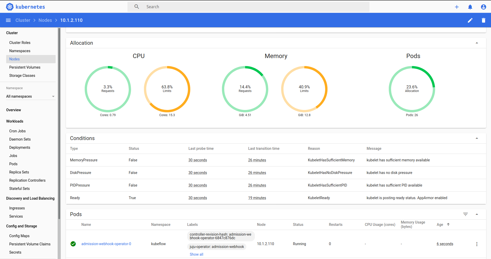

# Try to use `microk8s` to create the k8s

Check the version:

```
latest/stable     snap install --stable microk8s
latest/candidate  snap install --candidate microk8s
latest/beta       snap install --beta microk8s
1.21/stable       snap install --channel=1.21 microk8s
1.21/candidate    snap install --channel=1.21/candidate microk8s
1.21/beta         snap install --channel=1.21/beta microk8s
1.20/stable       snap install --channel=1.20 microk8s
1.20/candidate    snap install --channel=1.20/candidate microk8s
1.20/beta         snap install --channel=1.20/beta microk8s
1.19/stable       snap install --channel=1.19 microk8s
1.19/candidate    snap install --channel=1.19/candidate microk8s
1.19/beta         snap install --channel=1.19/beta microk8s
1.18/stable       snap install --channel=1.18 microk8s
1.18/candidate    snap install --channel=1.18/candidate microk8s
1.18/beta         snap install --channel=1.18/beta microk8s
1.17/stable       snap install --channel=1.17 microk8s
1.17/candidate    snap install --channel=1.17/candidate microk8s
1.17/beta         snap install --channel=1.17/beta microk8s
1.16/stable       snap install --channel=1.16 microk8s
1.16/candidate    snap install --channel=1.16/candidate microk8s
1.16/beta         snap install --channel=1.16/beta microk8s
1.15/stable       snap install --channel=1.15 microk8s
1.15/candidate    snap install --channel=1.15/candidate microk8s
1.15/beta         snap install --channel=1.15/beta microk8s
1.14/stable       snap install --channel=1.14 microk8s
1.14/candidate    snap install --channel=1.14/candidate microk8s
1.14/beta         snap install --channel=1.14/beta microk8s
1.13/stable       snap install --channel=1.13 microk8s
1.13/candidate    snap install --channel=1.13/candidate microk8s
1.13/beta         snap install --channel=1.13/beta microk8s
1.12/stable       snap install --channel=1.12 microk8s
1.12/candidate    snap install --channel=1.12/candidate microk8s
1.12/beta         snap install --channel=1.12/beta microk8s
1.11/stable       snap install --channel=1.11 microk8s
1.11/candidate    snap install --channel=1.11/candidate microk8s
1.11/beta         snap install --channel=1.11/beta microk8s
1.10/stable       snap install --channel=1.10 microk8s
1.10/candidate    snap install --channel=1.10/candidate microk8s
1.10/beta         snap install --channel=1.10/beta microk8s
```

Choose v1.18 to install.
```
$ sudo snap install microk8s --channel=1.18 --classic
```

Check the status:
```
$ sudo microk8s.status
microk8s is not running. Use microk8s inspect for a deeper inspection.
```
Please wait for a while that it will take some time on starting a cluster setting.

Check again after a while.
```
$ sudo microk8s.status 

microk8s is running
addons:
cilium: disabled
dashboard: disabled
dns: disabled
fluentd: disabled
gpu: disabled
helm: disabled
helm3: disabled
ingress: disabled
istio: disabled
jaeger: disabled
knative: disabled
kubeflow: disabled
linkerd: disabled
metallb: disabled
metrics-server: disabled
prometheus: disabled
rbac: disabled
registry: disabled
storage: disabled
```

Enable some relevant tools
```
$ microk8s enable dashboard dns registry istio 

Applying manifest
serviceaccount/kubernetes-dashboard created
service/kubernetes-dashboard created
secret/kubernetes-dashboard-certs created
secret/kubernetes-dashboard-csrf created
secret/kubernetes-dashboard-key-holder created
configmap/kubernetes-dashboard-settings created
role.rbac.authorization.k8s.io/kubernetes-dashboard created
clusterrole.rbac.authorization.k8s.io/kubernetes-dashboard created
rolebinding.rbac.authorization.k8s.io/kubernetes-dashboard created
clusterrolebinding.rbac.authorization.k8s.io/kubernetes-dashboard created
deployment.apps/kubernetes-dashboard created
service/dashboard-metrics-scraper created
deployment.apps/dashboard-metrics-scraper created
service/monitoring-grafana created
service/monitoring-influxdb created
service/heapster created
deployment.apps/monitoring-influxdb-grafana-v4 created
serviceaccount/heapster created
clusterrolebinding.rbac.authorization.k8s.io/heapster created
configmap/heapster-config created
configmap/eventer-config created
deployment.apps/heapster-v1.5.2 created

If RBAC is not enabled access the dashboard using the default token retrieved with:

token=$(microk8s kubectl -n kube-system get secret | grep default-token | cut -d " " -f1)
microk8s kubectl -n kube-system describe secret $token

In an RBAC enabled setup (microk8s enable RBAC) you need to create a user with restricted
permissions as shown in:
https://github.com/kubernetes/dashboard/blob/master/docs/user/access-control/creating-sample-user.md

dns is already enabled
Enabling the private registry
storage is already enabled
Applying registry manifest
namespace/container-registry created
persistentvolumeclaim/registry-claim created
deployment.apps/registry created
service/registry created
The registry is enabled
Enabling Istio
Fetching istioctl version v1.3.4.
  % Total    % Received % Xferd  Average Speed   Time    Time     Time  Current
                                 Dload  Upload   Total   Spent    Left  Speed
100   630  100   630    0     0     63      0  0:00:10  0:00:09  0:00:01   135
100 36.3M  100 36.3M    0     0  2218k      0  0:00:16  0:00:16 --:--:-- 5133k

(skip some processes...)
```

In the process, it will ask this question:
```
Enforce mutual TLS authentication (https://bit.ly/2KB4j04) between sidecars? If unsure, choose N. (y/N):
```
I chose "y".

In the end, the output message will be like below:
```
instance.config.istio.io/tcpbytereceived created
instance.config.istio.io/tcpconnectionsopened created
instance.config.istio.io/tcpconnectionsclosed created
handler.config.istio.io/prometheus created
rule.config.istio.io/promhttp created
rule.config.istio.io/promtcp created
rule.config.istio.io/promtcpconnectionopen created
rule.config.istio.io/promtcpconnectionclosed created
handler.config.istio.io/kubernetesenv created
rule.config.istio.io/kubeattrgenrulerule created
rule.config.istio.io/tcpkubeattrgenrulerule created
instance.config.istio.io/attributes created
destinationrule.networking.istio.io/istio-policy created
destinationrule.networking.istio.io/istio-telemetry created
Istio is starting
```

Then let use check the dashboard.
```
$ microk8s dashboard-proxy        
Checking if Dashboard is running.
Waiting for Dashboard to come up.
Dashboard will be available at https://127.0.0.1:10443
Use the following token to login:
```

Access this link and choose to login by token.
Then you can see the dashboard.


---
### Install kubeflow

```
$ microk8s enable kubeflow

Enabling dns...
Enabling storage...
Enabling ingress...
Enabling metallb:10.64.140.43-10.64.140.49...
Waiting for other addons to finish initializing...
Addon setup complete. Checking connectivity...
Bootstrapping...
Bootstrap complete.
Successfully bootstrapped, deploying...
Kubeflow deployed.
Waiting for operator pods to become ready.
Waited 0s for operator pods to come up, 31 remaining.
Waited 15s for operator pods to come up, 29 remaining.
Waited 30s for operator pods to come up, 29 remaining.
Waited 45s for operator pods to come up, 27 remaining.
Waited 60s for operator pods to come up, 26 remaining.
Waited 75s for operator pods to come up, 26 remaining.
Waited 90s for operator pods to come up, 25 remaining.
Waited 105s for operator pods to come up, 23 remaining.
Waited 120s for operator pods to come up, 21 remaining.
Waited 135s for operator pods to come up, 20 remaining.
Waited 150s for operator pods to come up, 19 remaining.
Waited 165s for operator pods to come up, 17 remaining.
Waited 180s for operator pods to come up, 14 remaining.
Waited 195s for operator pods to come up, 14 remaining.
Waited 210s for operator pods to come up, 14 remaining.
Waited 225s for operator pods to come up, 12 remaining.
Waited 240s for operator pods to come up, 11 remaining.
Waited 255s for operator pods to come up, 8 remaining.
Waited 270s for operator pods to come up, 7 remaining.
Waited 285s for operator pods to come up, 6 remaining.
Waited 300s for operator pods to come up, 4 remaining.
Waited 315s for operator pods to come up, 2 remaining.
Operator pods ready.

Congratulations, Kubeflow is now available.

The dashboard is available at http://10.64.140.44.xip.io

    Username: admin
    Password: UAZ86H2EVMF1BT1

To see these values again, run:

    microk8s juju config dex-auth static-username
    microk8s juju config dex-auth static-password

To tear down Kubeflow and associated infrastructure, run:

    microk8s disable kubeflow
```