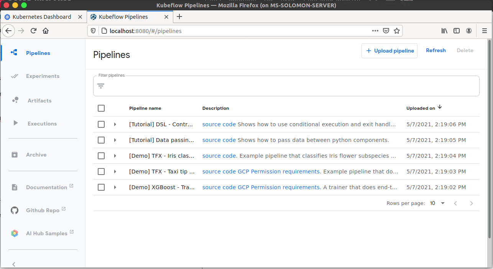

# Kubeflow with microk8s

The `microk8s` uses diffferent versions whether it can enable kubeflow.

### Check list:
- [x] 1.18/stable / classic : X
- [x] 1.20/edge / classic : X
- [x] 1.18 / classic : O


---

Check here:
https://github.com/ubuntu/microk8s/issues/1439#issuecomment-755831954


Still trying to install different versions of microk8s.

```
$ sudo snap remove microk8s --purge
$ sudo snap install microk8s --classic --channel=1.20/edge && sudo snap refresh
microk8s (1.20/edge) v1.20.6 from Canonical✓ installed
All snaps up to date.

$ microk8s enable dns dashboard storage gpu
Enabling DNS
Applying manifest
serviceaccount/coredns created
configmap/coredns created
deployment.apps/coredns created
service/kube-dns created
clusterrole.rbac.authorization.k8s.io/coredns created
clusterrolebinding.rbac.authorization.k8s.io/coredns created
Restarting kubelet
DNS is enabled
Enabling Kubernetes Dashboard
Enabling Metrics-Server
clusterrole.rbac.authorization.k8s.io/system:aggregated-metrics-reader created
clusterrolebinding.rbac.authorization.k8s.io/metrics-server:system:auth-delegator created
rolebinding.rbac.authorization.k8s.io/metrics-server-auth-reader created
Warning: apiregistration.k8s.io/v1beta1 APIService is deprecated in v1.19+, unavailable in v1.22+; use apiregistration.k8s.io/v1 APIService
apiservice.apiregistration.k8s.io/v1beta1.metrics.k8s.io created
serviceaccount/metrics-server created
deployment.apps/metrics-server created
service/metrics-server created
clusterrole.rbac.authorization.k8s.io/system:metrics-server created
clusterrolebinding.rbac.authorization.k8s.io/system:metrics-server created
clusterrolebinding.rbac.authorization.k8s.io/microk8s-admin created
Metrics-Server is enabled
Applying manifest
serviceaccount/kubernetes-dashboard created
service/kubernetes-dashboard created
secret/kubernetes-dashboard-certs created
secret/kubernetes-dashboard-csrf created
secret/kubernetes-dashboard-key-holder created
configmap/kubernetes-dashboard-settings created
role.rbac.authorization.k8s.io/kubernetes-dashboard created
clusterrole.rbac.authorization.k8s.io/kubernetes-dashboard created
rolebinding.rbac.authorization.k8s.io/kubernetes-dashboard created
clusterrolebinding.rbac.authorization.k8s.io/kubernetes-dashboard created
deployment.apps/kubernetes-dashboard created
service/dashboard-metrics-scraper created
deployment.apps/dashboard-metrics-scraper created

If RBAC is not enabled access the dashboard using the default token retrieved with:

token=$(microk8s kubectl -n kube-system get secret | grep default-token | cut -d " " -f1)
microk8s kubectl -n kube-system describe secret $token

In an RBAC enabled setup (microk8s enable RBAC) you need to create a user with restricted
permissions as shown in:
https://github.com/kubernetes/dashboard/blob/master/docs/user/access-control/creating-sample-user.md

Enabling default storage class
deployment.apps/hostpath-provisioner created
storageclass.storage.k8s.io/microk8s-hostpath created
serviceaccount/microk8s-hostpath created
clusterrole.rbac.authorization.k8s.io/microk8s-hostpath created
clusterrolebinding.rbac.authorization.k8s.io/microk8s-hostpath created
Storage will be available soon
Enabling NVIDIA GPU
NVIDIA kernel module detected
Addon dns is already enabled.
Applying manifest
daemonset.apps/nvidia-device-plugin-daemonset created
NVIDIA is enabled

$ microk8s enable kubeflow
Enabling dns...
Enabling storage...
Enabling ingress...
Enabling metallb:10.64.140.43-10.64.140.49...
Waiting for other addons to finish initializing...
Addon setup complete. Checking connectivity...

Couldn't contact api.jujucharms.com from within the Kubernetes cluster
Please check your network connectivity before enabling Kubeflow.

See here for troubleshooting help:

    https://microk8s.io/docs/troubleshooting#heading--common-issues


```

---
# 1.18 / classic 

can enable kubeflow and show the link 

However, I still cannot get the dashbaord. 

```
export KUBEFLOW_HOSTNAME="http://10.1.2.110"      
microk8s.enable kubeflow                                                 
```

---
Test:

Use this version 

Not enable kubeflow 
but enable other packages

use the apply method to create kubeflow

It can work!!!


But there is no jupyter-notebook.

### Steps:
```
> sudo snap install microk8s --classic --channel=1.18
> microk8s enable dns dashboard storage gpu
> microk8s enable registry istio 
> export PIPELINE_VERSION=1.0.4
> microk8s.kubectl apply -k "github.com/kubeflow/pipelines/manifests/kustomize/cluster-scoped-resources?ref=$PIPELINE_VERSION" 
> microk8s.kubectl wait --for condition=established --timeout=60s crd/applications.app.k8s.io                                  
> microk8s.kubectl apply -k "github.com/kubeflow/pipelines/manifests/kustomize/env/platform-agnostic-pns?ref=$PIPELINE_VERSION"
> microk8s.kubectl port-forward -n kubeflow svc/ml-pipeline-ui 8080:80
```
